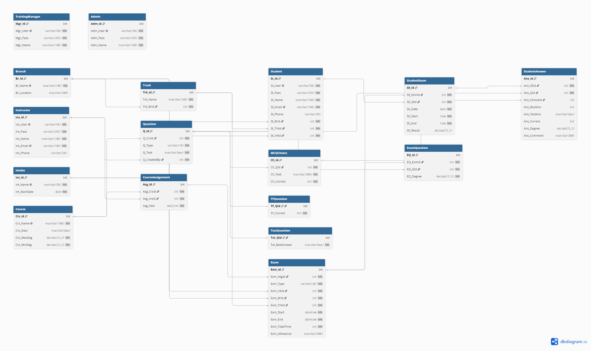

# Examination System Database (SQL Server)

A full T-SQL implementation of an **Examination System** for an educational institution — covering course/instructor assignment, exam creation (manual and random-generated), student scheduling, answer submission, and automated grading — built entirely with SQL Server database objects (no application layer).

Designed and implemented end-to-end from a written requirements specification: requirements analysis → ERD → schema → security → automated test suite, with **72/72 test cases passing**.

## Highlights

- **17 tables** with full referential integrity (FK, CHECK, UNIQUE constraints)
- **10 triggers** enforcing business rules that plain constraints can't express (e.g. branch/track matching, question-type consistency, exam-degree limits)
- **17 stored procedures** covering the full exam lifecycle: question creation, random/manual exam generation, student assignment, answer submission, grading, and text-answer marking
- **3 scalar/table functions** (exam total degree, answer normalization, answer validity check)
- **5 views** for reporting/read access
- **Role-based security** (logins, users, database roles, granular permissions)
- **Scheduled daily backup job**
- **72-case automated test suite** exercising every constraint, trigger, and THROW branch — see [Test Results](#test-results)

## Tech Stack

- Microsoft SQL Server (T-SQL)
- SQL Server Agent (backup job)

## Project Structure

```
├── sql/
│   ├── 01_FileGroups.sql              # Database + filegroup creation
│   ├── 02_Build_Schema_Objects.sql    # Tables, triggers, indexes, functions, procedures, views, seed data
│   ├── 03_Security_Setup.sql          # Logins, users, roles, permissions
│   ├── 04_Backup_Job.sql              # Scheduled daily backup job
│   ├── 05_Test_Execution.sql          # 72 automated test cases
│   └── 06_Verification_Queries.sql    # Object-count / permission sanity checks
├── docs/
│   ├── Requirements_Sheet.md          # Original requirements specification
│   ├── ERD.png                        # Entity-relationship diagram
│   ├── Objects_Description.docx       # Full description of every DB object
│   ├── Security_Roles_Guide.docx      # Roles & permissions reference
│   └── Test_Sheets.docx               # Test cases with actual execution results
└── README.md
```

## Entity-Relationship Diagram



17 tables covering identity/roles (Admin, TrainingManager, Instructor, Student), academic structure (Branch, Track, Intake, Course, CourseAssignment), the question bank (Question + its MCQChoice/TFQuestion/TextQuestion sub-types), and the exam lifecycle (Exam, ExamQuestion, StudentExam, StudentAnswer).

## Setup / Run Order

Run the scripts against a SQL Server instance **in this exact order**:

```sql
1. 01_FileGroups.sql
2. 02_Build_Schema_Objects.sql
3. 03_Security_Setup.sql
4. 04_Backup_Job.sql
5. 05_Test_Execution.sql        -- optional, runs the full test suite
6. 06_Verification_Queries.sql  -- optional, object-count / permission sanity checks
```

> Each script is idempotent against a fresh database. For a clean re-run, re-execute from step 1 (the test script depends on baseline seed data created in step 2).

> **Note:** four demo login accounts (Admin / Training Manager / Instructor / Student) are created in `03_Security_Setup.sql` with placeholder passwords. The full account list is kept out of this public repo for submission/review purposes — see the *Security & Access Control Guide* in `docs/` for the role design.

## Test Results

The full test suite (`05_Test_Execution.sql`) exercises every table constraint, trigger, stored procedure error path, and function — **72 out of 72 test cases passed**, matching their expected outcome exactly.

| Category | Test Cases | Result |
|---|---|---|
| Table Constraints (CHECK / UNIQUE) | 14 | ✅ 14/14 |
| Triggers | 19 | ✅ 19/19 |
| Stored Procedures | 34 | ✅ 34/34 |
| Functions | 5 | ✅ 5/5 |
| **Total** | **72** | **✅ 72/72** |

Full scenario-by-scenario results (expected vs. actual, with comments) are in [`docs/Test_Sheets.docx`](docs/Test_Sheets.docx).

## Design Notes

- Business rules that span multiple tables (e.g. "student's track must belong to their branch", "exam questions must belong to the exam's course") are enforced via triggers rather than application code, so data integrity holds regardless of the calling client.
- Stored procedures use structured `THROW` error codes (grouped by procedure, e.g. `50001`–`50019` for question/exam creation, `50500`–`50501` for answer submission) for predictable, machine-readable error handling by any front end.
- Random exam generation and manual exam creation are separated into two procedures with independent validation, since their constraints differ (pool availability vs. explicit question list).

## Author

Built by [Mrehan Mohamed] — 4th-year Electronics & Communications Engineering student, currently completing DEPI's Full-Stack .NET track.

[www.linkedin.com/in/mrehan-mohamed](#) · 
